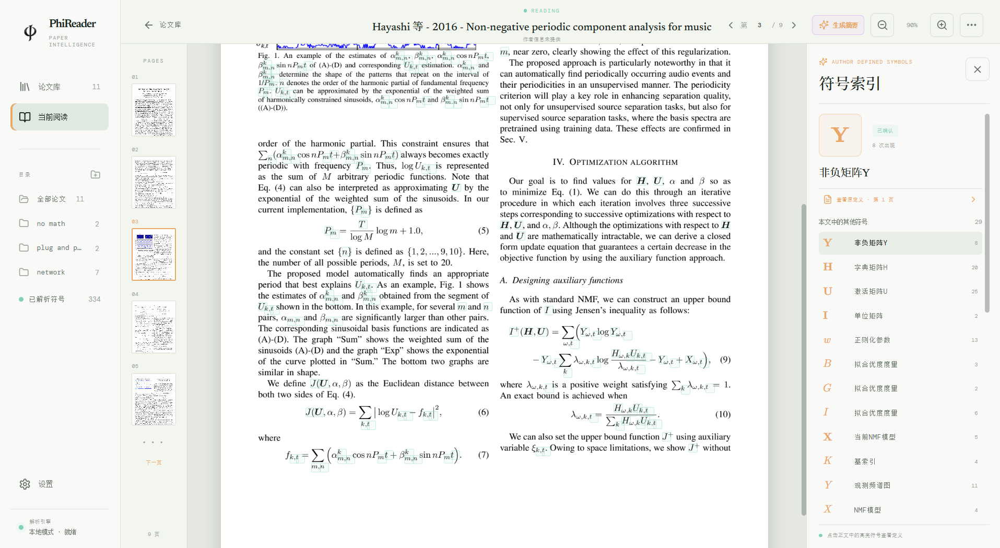
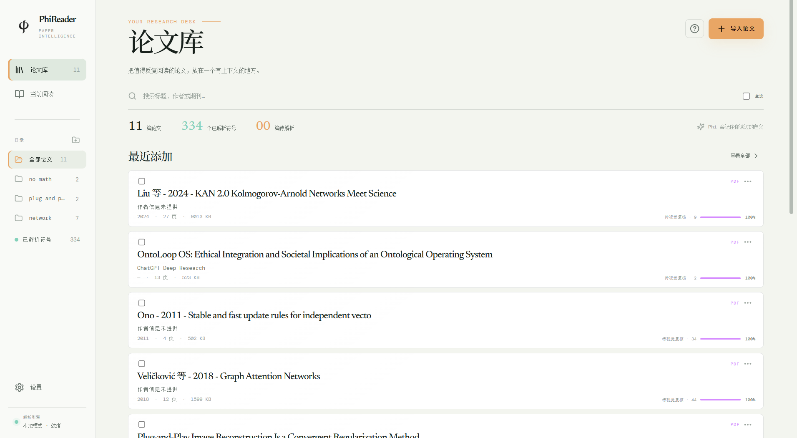

<div align="center">
  
  <h1>PhiReader</h1>
  <p><strong>让论文里的每一个符号，都能回到作者定义它的地方。</strong></p>
  <p>
    
    
    
  </p>
</div>

PhiReader 是一款面向论文读者的桌面阅读器。它会从 PDF 中识别作者定义过的数学符号，并把定义原文、所在页码、出现次数和可选摘要放到阅读界面旁边。

不必离开正文搜索符号，也不必在几十页之间来回翻找。点击论文中的高亮符号，就能快速查看作者在**这篇论文里**给出的定义。



<p align="center"><sub>KAN 2.0 真实论文页面：解析标记、已生成摘要、定义原文与全文符号索引同时可见。</sub></p>

## 为什么使用 PhiReader

### 符号不再脱离上下文

同一个 `λ`、`x` 或 `Φ`，在不同论文中可能有完全不同的含义。PhiReader 关注的不是通用数学词典，而是作者在当前论文中给出的定义。

- 点击正文中的高亮符号，侧栏立即显示其含义
- 保留作者定义原文，方便核对而不是盲信摘要
- 一键跳转到定义所在页，再返回原来的阅读位置
- 汇总同一符号在全文中的出现次数

### 为公式密集论文减少来回翻找

PhiReader 会结合 PDF 字体、版面和定义语句识别符号，适合机器学习、优化、信号处理、数学等公式密集型论文。它会区分同形但字体不同的符号，例如粗体 `x` 与普通 `x`；不确定的结果会进入待确认状态，而不是被当成确定答案。

### 摘要是辅助，原文才是依据

本地解析完成后即可查看定义原文，无需配置任何模型。需要更短的解释时，可以选择 Qwen、DeepSeek 或 OpenAI 兼容接口生成符号摘要；摘要始终和原定义、页码一起展示。

## 你的本地论文库

导入的论文会进入本地论文库。你可以按研究主题建立目录、搜索标题或作者、查看符号解析数量与处理进度，并从同一个入口继续上次阅读。



<p align="center"><sub>真实本地论文库：研究目录、论文条目、已解析符号数量与处理进度集中呈现。</sub></p>

- 拖放或批量导入 PDF
- 使用目录整理研究方向，同一篇论文无需重复存储
- 按标题、作者或期刊快速搜索
- 查看每篇论文的本地解析进度与符号数量
- 支持深色与浅色界面、中英文界面和阅读缩放

## 从导入到读懂

1. **导入 PDF**：将本地论文拖入 PhiReader，解析会在电脑上完成。
2. **照常阅读**：翻页、缩放并查看原始 PDF，已识别符号会直接标在页面上。
3. **点击符号**：在侧栏查看含义、定义原文、页码和全文出现次数。
4. **需要时生成摘要**：配置自己的模型 API Key，为定义生成更简短的说明。

## 本地优先与隐私

- PDF 文件、字体分析、版面分析和符号索引默认只保存在本机
- 不配置 API Key 也可以完成导入、解析、阅读和原文定义查询
- 只有主动生成摘要时，相关定义片段才会发送给所选模型服务

## 非发布版本安装

当前桌面版面向 Windows 10/11。若不使用 [GitHub Releases](../../releases) 页面的可用安装包，可以从源码构建安装程序。

准备以下环境：

- Node.js 24
- Python 3.10 或更高版本
- Rust stable
- Microsoft C++ Build Tools（Desktop development with C++）
- Microsoft Edge WebView2 Runtime

在 GitHub 页面点击 **Code → Download ZIP**，解压后在项目目录打开 PowerShell：

```powershell
npm ci
powershell -ExecutionPolicy Bypass -File .\tools\build_parser_helpers.ps1 -Clean
npm run tauri:build
```

构建完成后，可在以下目录找到 Windows 安装包：

```text
src-tauri\target\release\bundle\
```

安装后即可使用。

## 发布自动更新版本

桌面版会在启动时检查 GitHub Releases。发现更高版本后，会显示版本号和 Release 更新日志；用户确认后，应用会下载经过签名验证的更新、安装并自动重启。

首次启用发布流程时，在 GitHub 仓库的 **Settings → Secrets and variables → Actions** 中新增名为 `TAURI_SIGNING_PRIVATE_KEY` 的 Repository secret，其值为本地 `.tauri/phireader.key` 的完整内容。该私钥已被 Git 忽略，请另行安全备份；丢失后，已安装的旧版本无法信任用新密钥签名的更新。

发布新版本前，将 `package.json`、`package-lock.json`、`src-tauri/Cargo.toml` 和 `src-tauri/tauri.conf.json` 中的版本号同步更新。Release 工作流支持两个相互隔离的更新通道：

- `vX.Y.Z`：正式版本，发布为稳定 Release；正式版只检查 GitHub 的最新稳定版本。
- `vX.Y.Z-beta.N`：测试版本，发布为 Prerelease；测试版只检查固定的 beta 通道，不会向正式版用户推送。

推送匹配标签后，工作流会自动生成更新日志、安装包、签名文件和 `latest.json`。beta 构建完成后还会刷新 `beta` Release 中的通道清单，已安装的测试版因而可以继续收到后续测试版本。测试通过后再将功能分支合并到 `main`，并以新的稳定版本号发布正式标签。

## 当前状态

PhiReader 仍处于早期公开阶段，目前优先支持 Windows 与可提取文本的 PDF。扫描版论文、极少见字体或特殊排版的识别仍在开发中，欢迎您反馈您的使用体验，我会尽快修复您提出的问题。

## 许可证

PhiReader 采用 [MIT License](LICENSE)。
